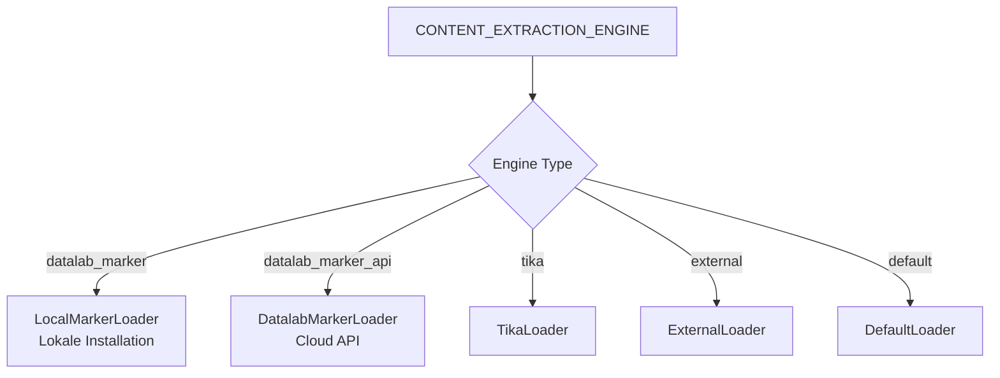

# Datalab Marker API Integration Plan

## Übersicht
Integration der Datalab Marker Cloud API als neue Content Extraction Engine "datalab_marker_api" neben der bestehenden lokalen Marker-Installation.

## Architektur



## Implementierungsschritte

### 1. Backend-Änderungen

#### 1.1 Import in main.py hinzufügen
**Datei:** `backend/open_webui/retrieval/loaders/main.py`

Nach Zeile 29 hinzufügen:
```python
from open_webui.retrieval.loaders.datalab_marker_api import DatalabMarkerLoader as DatalabMarkerAPILoader
```

#### 1.2 Neue Engine-Bedingung in der Loader-Klasse
**Datei:** `backend/open_webui/retrieval/loaders/main.py`

Nach dem bestehenden `datalab_marker` Block (nach Zeile 305) hinzufügen:
```python
elif (
    self.engine == "datalab_marker_api"
    and self.kwargs.get("DATALAB_MARKER_API_KEY")
    and file_ext
    in [
        "pdf",
        "xls",
        "xlsx",
        "ods",
        "doc",
        "docx",
        "odt",
        "ppt",
        "pptx",
        "odp",
        "html",
        "epub",
        "png",
        "jpeg",
        "jpg",
        "webp",
        "gif",
        "tiff",
    ]
):
    loader = DatalabMarkerAPILoader(
        file_path=file_path,
        api_key=self.kwargs.get("DATALAB_MARKER_API_KEY"),
        langs=self.kwargs.get("DATALAB_MARKER_LANGS"),
        use_llm=self.kwargs.get("DATALAB_MARKER_USE_LLM", False),
        skip_cache=self.kwargs.get("DATALAB_MARKER_SKIP_CACHE", False),
        force_ocr=self.kwargs.get("DATALAB_MARKER_FORCE_OCR", False),
        paginate=self.kwargs.get("DATALAB_MARKER_PAGINATE", False),
        strip_existing_ocr=self.kwargs.get(
            "DATALAB_MARKER_STRIP_EXISTING_OCR", False
        ),
        disable_image_extraction=self.kwargs.get(
            "DATALAB_MARKER_DISABLE_IMAGE_EXTRACTION", False
        ),
        output_format=self.kwargs.get(
            "DATALAB_MARKER_OUTPUT_FORMAT", "markdown"
        ),
    )
```

### 2. Frontend-Änderungen

#### 2.1 Admin Settings Component Update
**Datei:** `src/lib/components/admin/Settings/Documents.svelte`

Die Dropdown-Optionen für CONTENT_EXTRACTION_ENGINE erweitern:
```javascript
const engineOptions = [
    { value: '', label: 'Default' },
    { value: 'tika', label: 'Apache Tika' },
    { value: 'datalab_marker', label: 'Datalab Marker (Local)' },
    { value: 'datalab_marker_api', label: 'Datalab Marker (Cloud API)' },
    { value: 'external', label: 'External' }
];
```

#### 2.2 Bedingte Anzeige des API-Key Feldes
```svelte
{#if contentExtractionEngine === 'datalab_marker_api'}
    <div class="mt-4">
        <label class="block text-sm font-medium mb-2">
            Datalab Marker API Key
        </label>
        <input
            type="password"
            bind:value={datalabMarkerApiKey}
            class="w-full px-3 py-2 border rounded-md"
            placeholder="Enter your Datalab API key"
        />
        <p class="text-xs text-gray-500 mt-1">
            Get your API key from <a href="https://www.datalab.to" target="_blank" class="underline">datalab.to</a>
        </p>
    </div>
{/if}
```

### 3. Konfigurationsvalidierung

#### 3.1 API Key Validierung
In der Settings-Komponente sollte eine Validierung hinzugefügt werden:
```javascript
if (contentExtractionEngine === 'datalab_marker_api' && !datalabMarkerApiKey) {
    toast.error('Datalab Marker API Key is required for Cloud API mode');
    return;
}
```

### 4. Dokumentation Updates

#### 4.1 README.md
Neue Sektion für Content Extraction Engines:
```markdown
### Content Extraction Engines

- **Default**: Basic text extraction
- **Apache Tika**: Advanced document parsing (requires Tika server)
- **Datalab Marker (Local)**: High-quality PDF extraction using local Marker installation
- **Datalab Marker (Cloud API)**: High-quality PDF extraction using Datalab cloud service
- **External**: Custom extraction service

#### Datalab Marker Cloud API Setup
1. Get an API key from [datalab.to](https://www.datalab.to)
2. Set `CONTENT_EXTRACTION_ENGINE=datalab_marker_api`
3. Set `DATALAB_MARKER_API_KEY=your-api-key`
```

### 5. Umgebungsvariablen

Keine neuen Umgebungsvariablen erforderlich, da die bestehenden DATALAB_MARKER_* Variablen wiederverwendet werden.

### 6. Testing

#### 6.1 Unit Tests
```python
# test_datalab_marker_api_loader.py
def test_datalab_marker_api_loader():
    loader = DatalabMarkerAPILoader(
        file_path="test.pdf",
        api_key="test-key",
        output_format="markdown"
    )
    # Mock API responses
    # Test verschiedene Dateiformate
    # Test Fehlerbehandlung
```

#### 6.2 Integration Tests
- Test mit echtem API Key
- Test verschiedene Dateiformate
- Test Timeout-Handling
- Test große Dateien

### 7. Migration Guide

Für bestehende Nutzer:
1. Keine Änderungen erforderlich - `datalab_marker` funktioniert weiterhin mit lokaler Installation
2. Für Cloud API: Engine auf `datalab_marker_api` ändern und API Key eingeben

### 8. Performance-Überlegungen

- Cloud API hat höhere Latenz als lokale Installation
- Timeout von 10 Minuten für große Dateien
- Rate Limiting beachten (abhängig vom API Plan)

### 9. Sicherheitsaspekte

- API Key sicher speichern (bereits durch PersistentConfig abgedeckt)
- Dateien werden an externe API gesendet - Datenschutz beachten
- HTTPS für alle API-Aufrufe

### 10. Fehlerbehandlung

Die bestehende Fehlerbehandlung in `datalab_marker_api.py` deckt ab:
- API-Fehler
- Timeout
- Ungültige Antworten
- Datei-Fehler

## Nächste Schritte

1. Backend-Änderungen implementieren
2. Frontend-Komponente anpassen
3. Tests schreiben
4. Dokumentation aktualisieren
5. Review und Testing
6. Deployment